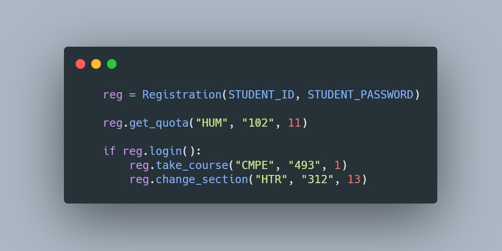

## Bogazici University Registration Bot
> **DISCLAIMER:** This software is for educational purposes only. Your account might be suspended because of script usage. USE THE SOFTWARE AT YOUR OWN RISK. THE AUTHORS ASSUME NO RESPONSIBILITY FOR RESULTS.



### Requirements
- [Requests](http://docs.python-requests.org/en/master/)
  `pip3 install requests`
- [Beautiful Soup](https://www.crummy.com/software/BeautifulSoup/bs4/doc/)
  `pip3 install beautifulsoup4`

> **NOTE:** It works with the old registration system, I didn't try it with new BUIS system. But BUIS pages are similar to old registration pages, I think it needs small changes.

### Usage
```python
from registration import Registration

# Create instance
reg = Registration(STUDENT_ID, STUDENT_PASSWORD)

# Set debug true for printing logs to console
reg.set_debug(True)

# Get quota for HUM102.01
reg.get_quota("HUM", "102", 11)

# If login your account is successful
if reg.login():
    # Take CMPE493.01 course
    reg.take_course("CMPE", "493", 1)
    
    # Take CMPE49J.01 course non-credit
    reg.take_course("CMPE", "49J", 1, non_credit=True)

    # Take HTR312.01 course credit and with-repeat
    reg.take_course("HTR", "312", 11, non_credit=False, repeat_with="HTR 312 DD")

    # Try to change HTR312 section 11 to 14
    for section in range(11, 15):
        reg.change_section("HTR", "312", section)
```
